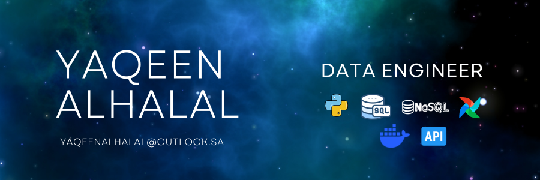

  

###

<h1 align="center">Hi 👋🏻, I'm Yaqeen!</h1>

<h3 align="center">A Data Engineer 👩🏻‍💻</h3>

  

<h3 align="left">👩🏻‍💻 About Me</h3>

###

I'm Yaqeen Alhalal, a Data Engineer from Saudi Arabia 🇸🇦  

• I enjoy building data pipelines and systems that turn messy, scattered data into something reliable and useful.  

• I thrive on hard problems — debugging, figuring out how systems fit together, and making things actually work is what drew me to Data Engineering.  

• My interests include data pipelines, orchestration, data quality, APIs, cloud technologies, and stream processing.  

• Fluent in English, Python, and SQL. 😉  

• Currently learning Italian 🇮🇹, Russian 🇷🇺, Arabic Sign Language 🤟🏻, and stream processing.

###

<h3 align="left">🔥 My Stats</h3>

###

  
  
  

###

<h3 align="left">🛠 Languages & Tools</h3>

###

  
  
  
  
  
  
  
  
  
  
  
  
  
  
  
  
  
  
  
  
  
  
  
  
  

###

<h3 align="left">🤝 Connect with Me</h3>

###

  
  
  
  

